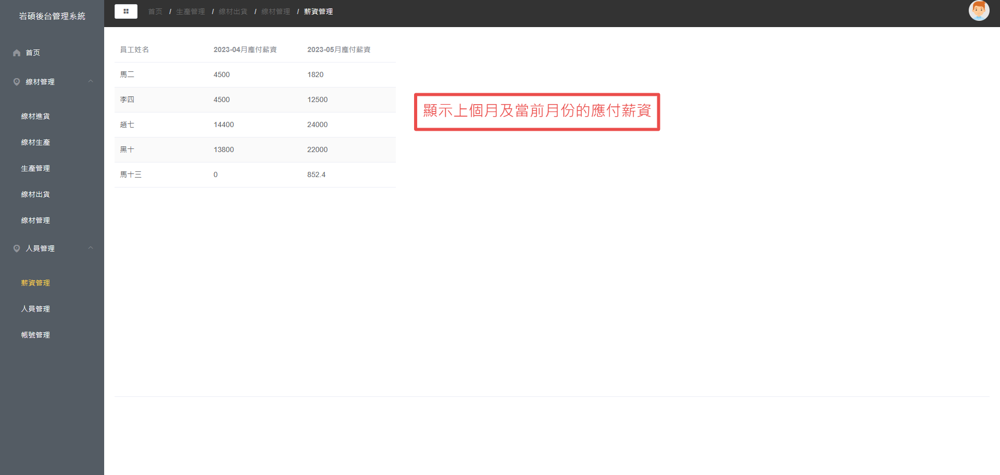

# Yansol-admin
岩碩線材管理系統「Yansol-admin」是一個前後端分離的項目，前端使用Vue.js，後端使用Spring Boot Data JPA、Maven等技術。該項目使用JWT進行權限驗證，可以根據不同的帳號顯示對應的導航菜單。


## 使用技術
- 前端
  - html
  - css
  - javascript
  - Vue、axios
- 後端
  - SpringBoot Data Jpa
- 資料庫
  - MySql
- 其他
  - Git、Github
  - Maven
  - MVC設計模式
  - RESTful API
  - Tomcat


## 實現功能(Service)

Yansol-admin依業務劃分可分為五個主要模組


| 模組     | 需求                                                   |
| -------- | ------------------------------------------------------ |
| 帳號     | 可添加、修改用戶帳號信息，頁面依帳號權限決定顯示的頁面 |
| 廠商     | 可添加、修改廠商信息                                   |
| 員工     | 可添加、修改員工信息                                   |
| 線材     | 線材進貨、線材生產、線材出貨、線材管理                 |
| 生產訂單 | 線材分配生產訂單給員工，當線材完成後可出貨             |

## 演示(Demo)


### 登入頁面

- 根據權限，決定顯示的頁面
- 以Ajax請求，即時驗證填入的資訊，並做出提醒(如帳號密碼錯誤)
  - 登入(提示輸入帳號密碼)
    
  - 登入(提示帳號密碼錯誤)
    
  - 一般用戶(一般用戶的首頁及導航菜單)
    
  - 管理員(管理員的首頁及導航菜單)


### ***管理員*** - 頁面功能介紹

#### 首頁

- 頁面功能：快速查看待完成線材清單，本月進出貨數量清單，營運圖表資料
- 左側為導航菜單(依帳號權限不同，決定顯示導航菜單，實現權限驗證)
- 實現導航菜單收折、麵包屑...等功能
- 顯示帳號權限、員工姓名、待完成線材清單、本月進出貨數量清單、營收折線圖、廠商收入柱狀圖、員工收入圓餅圖...等功能


#### 線材管理

##### 	線材進貨頁面

- 頁面功能：線材進貨時，將線材資料添加到資料庫
- 可多筆添加線材進貨資料
- 驗證輸入資料正確性


##### 	線材生產頁面

- 頁面功能：可對進貨線材進行生產分配，以及查詢線材的生產分配資料，若線材已經全部分配生產並皆生產完成後，則不會顯示在清單中
- 顯示當前線材生產清單
- 可對線材進行生產訂單分配
- 可依關鍵字查詢線材


##### 	生產管理頁面

- 頁面功能：可對生產中的訂單，進行修改、刪除或輸入完成日期表示該生產訂單已完成
- 顯示生產訂單清單
- 可對生產訂單進行修改、刪除
- 可依關鍵字查詢線材
- 可隱藏已完成生產訂單


##### 	線材出貨頁面

- 頁面功能：可對已生產完成的線材進行出貨或查看線材生產細節
- 當線材生產訂單都完成後，表示可出貨，會顯示在線材出貨清單
- 可對線材進行出貨、或查看線材之生產訂單詳情
- 可依關鍵字查詢線材


##### 	線材管理頁面

- 頁面功能：全部的線材都在此頁面進行管理，可對線材資料進行修改操作、查看線材生產細節
- 顯示線材清單
- 可對線材清單進行修改、或查看線材之生產訂單詳情
- 可依關鍵字查詢線材


#### 人員管理

##### 	薪資管理

- 頁面功能：自動計算上個月及當前月份的應付薪資，可當作發薪參考資料



##### 	人員管理

- 頁面功能：維護員工資料

- 顯示員工信息清單

- 對員工信息進行新增、修改、刪除
- 可依關鍵字查詢員工


##### 	帳號管理

- 頁面功能：維護員工帳號資料

- 顯示帳號信息清單

- 可對帳號信息進行新增、修改、刪除
- 可依關鍵字查詢線材


### ***一般使用者*** - 頁面功能介紹

#### 首頁

- 頁面功能：快速查看待完成訂單
- 左側為導航菜單(依帳號權限不同，決定顯示導航菜單，實現權限驗證)
- 實現導航菜單收折、麵包屑...等功能
- 顯示帳號權限、員工姓名、待完成線材清單..等功能


#### 線材生產頁面

- 頁面功能：維護員工帳號資料
- 生產訂單完成後可輸入完成日期，即表示該生產訂單已完成，之後不會顯示在此頁面


#### 薪資試算頁面

- 頁面功能：可查詢輸入月份的完成生產訂單以及薪資試算結果


## 專案結構:

- 本專案使用的環境: JDK8、MySQL 8.0、SpringBoot 2.6.4、Maven 3.0.4

```
src
 └─main
     ├─java
     │  └─com
     │      └─shung
     │          ├─controller  #控制層，處理ModelandView
     │          ├─mapper      #mybatis的mapper
     │          ├─pojo        #javabean
     │          ├─service     #業務邏輯
     │          │  └─Impl
     │          └─test
     ├─resources              #設定檔
     │  └─com
     │      └─shung
     │          └─mapper      #mybatis的mapper.xml
     └─webapp
         ├─static             #靜態資源
         │  ├─css             #.css
         │  ├─img             #圖片
         │  └─script          #.js
         └─WEB-INF
             └─templates
                 └─pages      #頁面
                     ├─cart   #購物車頁面
                     ├─common #通用頁面
                     ├─error  #錯誤頁面
                     ├─manager#管理者頁面
                     ├─order  #訂單頁面
                     └─user   #使用者頁面
Yansol
├─msystem    #後端SpringBoot
│  ├─src
│  │  ├─main
│  │  │  ├─java
│  │  │  │  └─com
│  │  │  │      └─msystem
│  │  │  │          ├─controller   #控制層
│  │  │  │          ├─dto		#資料傳輸物件
│  │  │  │          ├─entity	  #容器類
│  │  │  │          ├─filter  	     #過濾器
│  │  │  │          ├─repository  #SpringBoot Data Jpa的自訂異方法配置
│  │  │  │          ├─service	  #業務邏輯
│  │  │  │          │  └─Impl
│  │  │  │          └─utils		   #通用工具
│  │  │  └─resources
│  │  │      ├─static
│  │  │      └─templates
│  │  └─test
│  │      └─java
│  │          └─com
│  │              └─msystem
└─msystem-web    #前端Vue
   ├─public
   └─src
       ├─api			#封裝axios方法
       ├─assets			 #靜態資源
       │  └─images
       │      └─readme
       ├─components		#組件
       ├─router			   #路由器
       ├─store			   #Vuex
       ├─utils			     #通用js
       └─views			  #視圖
```


版本(Version)


V1.0--2023/04/25

--完成架構及項目首頁

V1.1--2023/04/26

--修改代碼將資料轉移到vuex中


V1.1.1--2023/05/09

--人員管理頁面完成

--登入頁面完成

--帳號管理頁面完成

--權限管理完成

--JWT權限驗證完成

V1.1.2--2023/05/13

--完成薪資管理頁面

--線材進貨頁面

--線材生產頁面

V1.1.3--2023/05/19

--完成生產管理頁面

--線材出貨頁面

--線材管理頁面

V1.1.4--2023/05/23

--完成使用者首頁

--線材生產頁面

--薪資試算頁面
